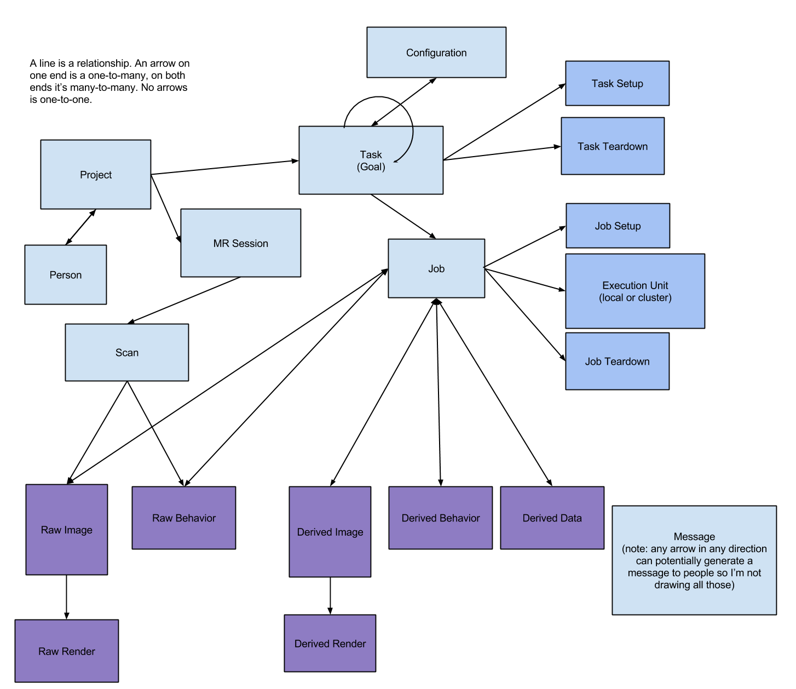

Technical Specification
=======================

The key words "MUST", "MUST NOT", "REQUIRED", "SHALL", "SHALL NOT", "SHOULD", "SHOULD NOT", "RECOMMENDED", "MAY", and "OPTIONAL" in this document are to be interpreted as described in `RFC 2119 <https://www.ietf.org/rfc/rfc2119.txt>`_

Models
++++++

